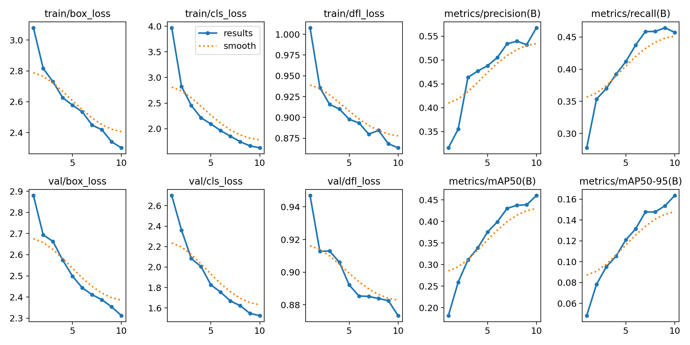
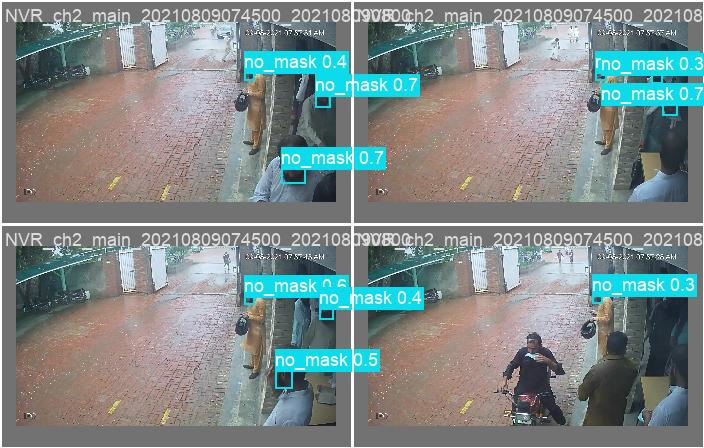

<div align="center">

# 😷 Face Mask Detection

### Real-time face-mask compliance monitoring powered by **YOLOv8**

A web application that detects whether people are wearing a mask **correctly**, **improperly**, or **not at all** — straight from a live webcam feed or an uploaded image. Built as an **AI internship project at Packages Limited**.


</div>

---

## ✨ Features

- 🎥 **Live webcam detection** — frames are analyzed several times per second with bounding boxes drawn in real time.
- 🖼️ **Image upload mode** — drop in any photo and get an instant verdict.
- 🟢🟡🔴 **Three-class detection** — `Mask On`, `Improper Mask`, and `No Mask`, each colour-coded.
- 📊 **Live confidence meter & stats** — see model confidence, faces found, and checks-per-second.
- 🔒 **HTTPS out of the box** — a self-signed certificate is auto-generated so the browser allows camera access.
- 📱 **Responsive UI** — clean dark dashboard that works on desktop and mobile.
- 🚀 **Deployment-ready** — works locally over HTTPS and on platforms like Render.

---

## 🖥️ Demo

> Add a screenshot or GIF of the running app here, e.g. `docs/demo.png`.

| Live detection | Training results |
| --- | --- |
| _your app screenshot_ |  |

Sample model predictions on the validation set:



---

## 🧠 Model

| | |
| --- | --- |
| **Architecture** | YOLOv8n (Ultralytics) |
| **Classes** | `mask`, `no_mask`, `improper_mask` |
| **Image size** | 320 × 320 |
| **Training** | 10 epochs, transfer-learned from `yolov8n.pt` |
| **Dataset split** | 1,223 train · 349 val · 176 test |
| **Export** | PyTorch (`best.pt`) + ONNX (`best.onnx`) |

**Validation metrics (epoch 10):**

| Precision | Recall | mAP@50 | mAP@50-95 |
| :---: | :---: | :---: | :---: |
| 0.57 | 0.46 | 0.46 | 0.16 |

> ℹ️ These numbers come from a short 10-epoch CPU training run. Accuracy improves significantly with more epochs, a larger backbone (`yolov8s/m`), and GPU training.

---

## 🛠️ Tech Stack

**Backend:** Python · Flask · Ultralytics YOLOv8 · OpenCV · NumPy
**Frontend:** HTML5 · CSS3 · Vanilla JavaScript (Canvas API, MediaDevices API)
**Model:** YOLOv8 object detection (PyTorch / ONNX)

---

## 🚀 Getting Started

### 1. Clone the repository
```bash
git clone https://github.com/<your-username>/Mask_Detection.git
cd Mask_Detection
```

### 2. Create a virtual environment & install dependencies
```bash
python -m venv .venv
# Windows
.venv\Scripts\activate
# macOS / Linux
source .venv/bin/activate

pip install -r requirements.txt
```

### 3. Run the app
```bash
python app.py
```

Open **https://127.0.0.1:5000** in your browser.
The first run generates a self-signed certificate — click *Advanced → Proceed* to accept it (this is required so the browser grants camera access).

---

## 📁 Project Structure

```
Mask_Detection/
├── app.py                 # Flask server + /detect inference endpoint
├── train_model.py         # Train / export the YOLOv8 model
├── test.py                # Quick single-image prediction test
├── Split.py               # Train/test dataset splitter
├── data.yaml              # YOLO dataset config (class names & paths)
├── requirements.txt
├── templates/
│   └── index.html         # UI
├── static/
│   ├── css/styles.css     # Dashboard styling
│   └── js/script.js       # Camera, upload & bounding-box logic
└── runs/detect/train2/
    └── weights/best.pt    # Trained model weights
```

> The raw image datasets and the large `.zip` archive are **excluded from the repo** via `.gitignore` (they exceed GitHub's file-size limits). The trained weights are included so the app runs immediately after cloning.

---

## 🔌 API

`POST /detect` — send a base64 image, receive detections.

```jsonc
// Request
{ "image": "data:image/jpeg;base64,..." }

// Response
{
  "status": "success",
  "prediction": "mask",
  "confidence": 0.93,
  "detections": [
    { "label": "mask", "display": "Mask On", "confidence": 0.93, "box": [x1, y1, x2, y2] }
  ],
  "image_width": 1280,
  "image_height": 720
}
```

`GET /health` — returns service status and the list of class names.

---

## 🔭 Possible Improvements

- Train longer on GPU with a larger model for higher mAP.
- Add multi-face tracking and per-person compliance counts.
- Log violations / export compliance reports for factory floors.
- Dockerize for one-command deployment.

---

## 🙏 Acknowledgements

Built during an **AI / Computer Vision internship at [Packages Limited](https://www.packages.com.pk/)**.
Powered by [Ultralytics YOLOv8](https://github.com/ultralytics/ultralytics).

---

<div align="center">

⭐ If you find this project useful, consider giving it a star!

</div>
